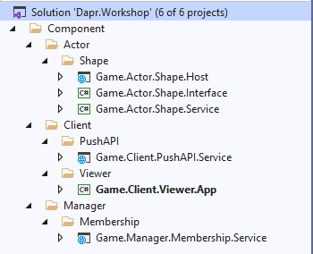
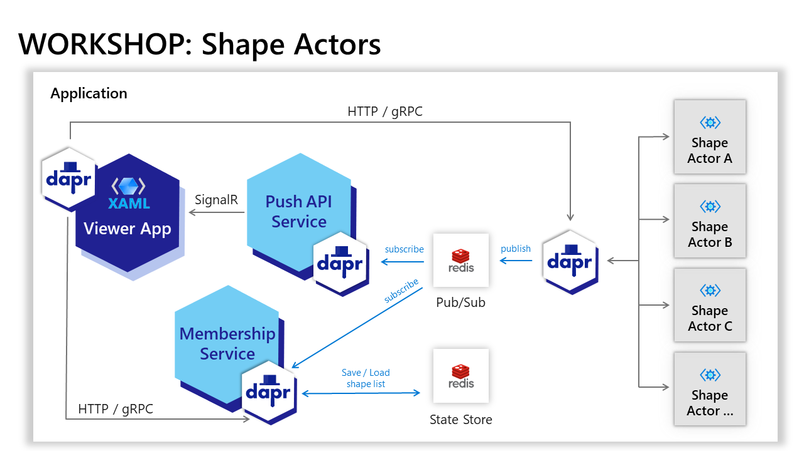

# Introduction

In this workshop we will build a building a small system to demonstrate the core capabilities of Dapr:
- service invocation
- state management
- publish/subscribe
- actors

## Prerequisites

- [.NET Core 3.1 or .NET 5+](https://dotnet.microsoft.com/download) installed
- [Dapr CLI](https://docs.dapr.io/getting-started/install-dapr-cli/)
- [Initialized Dapr environment](https://docs.dapr.io/getting-started/install-dapr-selfhost/)

## Static architecture


## Explore the start solution
Open the start solution for Visual Studio in the sub folder `Start`: [Dapr.Workshop.sln](Start/Dapr.Workshop.sln)
> or open the sub folder in Visual Studio Code


- Shape Actor component
  - Interface
    Contains the actor interface
  - Service
    Contains the actor implementation
  - Host
    Contains the actor hosting (dapr sidecar)
- Membership Manager component
  - Service
    Contains the membership implementation + hosting + shape list state
- Push API Client component
  - Service
    Contains the push API implementation (SignalR) + hosting
- Viewer Client compoment
  - App
    A Windows WPF.Core app for displaying the shapes

## Data flow


## Exercise 1 - Implement the Shape Actor

Open `ShapeActor.cs` in the Shape Actor service implementation. The class implements the `IShapeActor` interface and inherits from the default dapr `Actor` class.
``` cs
public class ShapeActor : Actor, IShapeActor
```

This actor will contain both logic and state:
- logic:
  - create a shape on a rondom position (location)
  - move the shape to a new position (location) each 500 ms
- state
  - the current shape position

Implement the logic to create a random shape position on activation of a new shape actor instance and save the new position in the actor's state:
- Override `OnActivateAsync()` in `ShapeActor`
  ``` cs
        protected override async Task OnActivateAsync()
        {
            Console.WriteLine($"Activate ShapeActor {Id.GetId()}");
            var actorIdParts = this.Id.GetId().Split('_');
            var clientId = actorIdParts[0];
            var shapeId = actorIdParts[1];

            // this is the first time the actor is activated --> initiate the actor state
            await StateManager.TryAddStateAsync(ShapeStateName, CreateNewShape());

            // base
            await base.OnActivateAsync();
        }

        /// <summary>
        /// Create a new shape with a random position.
        /// </summary>
        /// <returns>The created shape.</returns>
        private Shape CreateNewShape()
        {
            var randomizer = new Random();
            var diff = new int[2] { -1, 1 };

            return new Shape()
            {
                X = randomizer.Next(10, 900),
                Y = randomizer.Next(10, 600),
                Angle = 0,
                DiffX = diff[randomizer.Next(0, 2)],
                DiffY = diff[randomizer.Next(0, 2)]
            };
        }

  ```
  
Implement the `RetrievePosition` method to retrieve the current shape position
``` cs
public Task<Shape> RetrievePosition()
{
    // get from the actor state
    return StateManager.GetStateAsync<Shape>(ShapeStateName);
}
```

Setup the hosting of the Actor.
- Navigate to the Host project of the Shape Actor. This is a default ASP.NET Core web app host.
- Open `Startup.cs`
- In the `ConfigureServices` method register the `ShapeActor` service
  ``` cs
  public void ConfigureServices(IServiceCollection services)
  {
      services.AddActors(options =>
      {
          options.Actors.RegisterActor<ShapeActor>();
          options.ActorScanInterval = TimeSpan.FromMinutes(10);
      });
  }
  ```
- In the `Configure` method make sure the Actor endpoint mapping is configured
  ``` cs
  app.UseEndpoints(endpoints =>
  {
      endpoints.MapActorsHandlers();
  });
  ```

Test the shape actor functionality
- Run the actor service locally by the running the following command in the `.\Start\Component\Actor\Shape\Host` directory
  ``` sh
  dapr run --dapr-http-port 3500 --app-id shape_actor --app-port 3000 dotnet run
  ```
  This command will start the actor host and the dapr sidecar in parallel.
- Invoke the Shape Actor method `RetrievePosition` by running the following command. As actor id `clientA_shapeA` will be used
  ```sh
  curl -X POST http://127.0.0.1:3500/v1.0/actors/ShapeActor/74f02f26a60c41bd8324fd34e3b2397c_f942074674d64e108101c7477a24d260/method/RetrievePosition
  ```
- To stop the ShapeActor service host, press `Ctrl + C`


## Exercise 2 - Implement the Membership Manager service
Actors instances are indepentend from each other. It's not possible to get a list of all active actor instances. To provide an overview of all active shape actor instances of a viewer app (client) instance, we will need another statefull service. This service is managing the onboarding of viewer app instances and will also maintain the list of active shapes per viewer app instance.

Open `Startup.cs` in the Membership Manager service implementation. The service is hosted as a normal ASP.NET Core web app. This service will also be accompanied by a dapr side car.

This service will contain both logic and state:
- logic:
  - subscribe on events when a new shape actor is activated (pub/sub)
  - return the list of shapes per viewer app (client)
- state
  - the list of shapes per viewer app (client)

For implementing the logic using Dapr we will use the ASP.NET Core routing. The Dapr state-store will be used for storing the list of shapes.

- Register the Dapr client in the `ConfigureServices` method in `Startup.cs`. The Dapr client is needed for state management. Also configure the json serialization options.
  ``` cs
  public void ConfigureServices(IServiceCollection services)
  {
      services.AddDaprClient();
      services.AddSingleton(new JsonSerializerOptions()
      {
          PropertyNamingPolicy = JsonNamingPolicy.CamelCase,
          PropertyNameCaseInsensitive = true,
      });
  }
  ```
- Register cloud events in the `Configure` method below the `app.UseRouting()`
  ``` cs
  app.UseCloudEvents();
  ```
  `UseCloudEvents()` registers the Cloud Events middleware in the request processing pipeline. This middleware will unwrap requests with Content-Type `application/cloudevents+json` so that application code can access the event payload in the request body directly. This is recommended when using pub/sub unless you have a need to process the event metadata yourself.

- Add the Dapr endpoint mappings in the `Configure` method
  ``` cs
  app.UseEndpoints(endpoints =>
  {
      endpoints.MapSubscribeHandler();

      endpoints.MapGet("{clientId}", Onboard);
      endpoints.MapPost("onCreatedShape", OnCreatedShape).WithTopic(PubSubName, "onCreatedShape");
  });
  ```

  `MapSubscribeHandler()` registers an endpoint that will be called by the Dapr runtime to register for pub/sub topics. This is is not needed unless using pub/sub.

  `MapGet(...)` and `MapPost(...)` are provided by ASP.NET Core routing - these are used to setup endpoints to handle HTTP requests.

  `WithTopic(...)` associates an endpoint with a pub/sub topic.

- Implement the `Onboard` and `OnCreateShape` mapping methods, immedialty below `app.UseEndpoints(...)`
  ``` cs
      app.UseEndpoints(endpoints =>
      {
          ...
      });

      async Task Onboard(HttpContext context)
      {
                Console.WriteLine("Enter Onboard");
                var client = context.RequestServices.GetRequiredService<DaprClient>();

                var clientId = (string)context.Request.RouteValues["clientId"];
                Console.WriteLine("Onboard ClientId {0}", clientId);

                var shapeList = await RetrieveShapeListFromState(clientId, client);
                Console.WriteLine("Number of shapes: {0}", shapeList.Count);

                context.Response.ContentType = "application/json";
                await JsonSerializer.SerializeAsync(context.Response.Body, shapeList, serializerOptions);
      }

      async Task OnCreatedShape(HttpContext context)
      {
          Console.WriteLine("Enter OnCreatedShape");
          var client = context.RequestServices.GetRequiredService<DaprClient>();

          var shapeActorId = await JsonSerializer.DeserializeAsync<ShapeActorId>(context.Request.Body, serializerOptions);
          Console.WriteLine("ShapeActorId: ClientId {0}, ShapeId {1}", shapeActorId.ClientId, shapeActorId.ShapeId);

          var shapeList = await RetrieveShapeListFromState(shapeActorId.ClientId.ToString("N"), client);
          Console.WriteLine("Number of shapes: {0}", shapeList.Count);

          if (!shapeList.Any(shapeId => shapeId == shapeActorId.ShapeId))
          {
              shapeList.Add(shapeActorId.ShapeId);
              await client.SaveStateAsync(ShapeListStateName, shapeActorId.ClientId.ToString("N"), shapeList);
              Console.WriteLine("New shape added");
          }
      }
  ```

## Exercise 3 - Extend the Shape Actor service with OnCreatedShape event
When a new Shape Actor instance is activated, the actor  must be registered in the list of all actors of the viewer app instance.

Open `ShapeActor.cs` in the Shape Actor service implementation.

- Extend the `OnActivateAsync()` method by adding a pub/sub publish of the OnCreatedShape event just after activation of a new actor instance
  ``` cs
  protected override async Task OnActivateAsync()
  {
      ...

      // add this shape instance to list (via publish)
      var client = new DaprClientBuilder().UseJsonSerializationOptions(_jsonOptions).Build();
      await client.PublishEventAsync("pubsub", "onCreatedShape", new { ClientId = Guid.Parse(clientId), ShapeId = Guid.Parse(shapeId) });

      // base
      await base.OnActivateAsync();
  }

  ```

Test the shape actor and membership functionality
- Run the Membership Manager service locally by the running the following command in the `.\Start\Component\Manager\Membership\Service` directory
  ``` sh
  dapr run --app-id membership --app-port 5000 dotnet run
  ```
  This command will start the membership service and the dapr sidecar in parallel.
- Run the actor service locally by the running the following command in the `.\Start\Component\Actor\Shape\Host` directory
  ``` sh
  dapr run --dapr-http-port 3500 --app-id shape_actor --app-port 3000 dotnet run
  ```
  This command will start the actor host and the dapr sidecar in parallel.
- Invoke the Shape Actor method `RetrievePosition` by running the following command. As actor id `clientA_shapeA` will be used
  ```sh
  curl -X POST http://127.0.0.1:3500/v1.0/actors/ShapeActor/clientA_shapeA/method/RetrievePosition'
  ```
- To stop the ShapeActor service host, press `Ctrl + C`
- To stop the Membership service host, press `Ctrl + C`


## Exercise 4 - Extend the Shape Actor service with OnUpdatedShapeLocation event
We want the Shape Actor to update it's position automatically every 500 ms. Dapr actors supports 2 types of timers:
- normal timers
  These timers will only be active when an actor instance is in memory. Idle actor instances will be removed from memory after an idle timeout. Th associated timers will be deactivated as well.
- Reminders
  These timers will always be active, also when an actor instance is removed from memory.

Open `ShapeActor.cs` in the Shape Actor service implementation.

Implement a reminder timer.
- Add the reminder capability to the the ShapeActor service by adding the `IRemindable` interface
  ``` cs
  public class ShapeActor : Actor, IShapeActor, IRemindable
  {
      ...

      public async Task ReceiveReminderAsync(string reminderName, byte[] state, TimeSpan dueTime, TimeSpan period)
      {
          await CalculateNewPosition();
      }

      ...
  }
  ```
- add logic for calculating a new position
  ``` cs
  private async Task CalculateNewPosition()
  {
      // get the current state
      var result = await StateManager.TryGetStateAsync<Shape>(ShapeStateName);
      if (result.HasValue)
      {
          // calculate the new position
          var shape = result.Value;

          if (shape.X > 900) shape.DiffX = -2;
          if (shape.X < 10) shape.DiffX = 2;
          if (shape.Y > 600) shape.DiffY = -2;
          if (shape.Y < 10) shape.DiffY = 2;

          shape.X += shape.DiffX;
          shape.Y += shape.DiffY;
          shape.Angle++;

          // save the new position in the state
          await StateManager.SetStateAsync(ShapeStateName, shape);

          // notify any subscribers the position has changed (publish on pub/sub)
          var actorIdParts = this.Id.GetId().Split('_');
          var clientId = actorIdParts[0];
          var shapeId = actorIdParts[1];
          var client = new DaprClientBuilder().UseJsonSerializationOptions(_jsonOptions).Build();
          await client.PublishEventAsync("pubsub", "onUpdatedShapeLocation", new { ClientId = Guid.Parse(clientId), ShapeId = Guid.Parse(shapeId) });
      }
      else
      {
          Console.WriteLine($"ShapeActor {Id.GetId()} can't get the state.");
      }
  }
  ```

## Exercise 5 - Implement the Push API service
It's not easy to self-host a dapr sidecar in a windows client app. The .net core SDK certainly doesn't support that. So subscribing to a pub/sub event in a windows app using the Dapr client library is not possible.

We want the viewer app to be able to act on the `OnUpdatedShapeLocation` event to show the new location immediatly. For that we fall back on SignalR, which is capable to push events over the web (web sockets).
> in future Dapr components, SignalR will be supported as ["Bindings"](https://docs.dapr.io/reference/api/bindings_api/)

For now the Push API will be implemented as a standard ASP.NET Core web app with a SignalR hub and using Dapr pub/sub to subscribe a events and push these events to the viewer app via SignalR.

Open `Startup.cs` in the Push API Client service implementation. The service is hosted as a normal ASP.NET Core web app. This service will also be accompanied by a dapr side car.

This service will contain only logic:
- logic:
  - subscribe on events when a new shape location is calculated (pub/sub)
  - push the event to the viewer app (SignalR)

For implementing the logic using Dapr we will use the ASP.NET Core controllers.

- Register Dapr controllers in the `ConfigureServices` method in `Startup.cs`. This will add the Dapr controller feature.
  ``` cs
  public void ConfigureServices(IServiceCollection services)
  {
      services
          .AddControllers()
          .AddDapr();

      // default json serializer settings
      services.AddSingleton(new JsonSerializerOptions()
      {
          PropertyNamingPolicy = JsonNamingPolicy.CamelCase,
          PropertyNameCaseInsensitive = true
      });

      // add SignalR support
      services.AddSignalR();
  }
  ```
- Register cloud events in the `Configure` method below the `app.UseRouting()`
  ``` cs
  app.UseCloudEvents();
  ```
  `UseCloudEvents()` registers the Cloud Events middleware in the request processing pipeline. This middleware will unwrap requests with Content-Type `application/cloudevents+json` so that application code can access the event payload in the request body directly. This is recommended when using pub/sub unless you have a need to process the event metadata yourself.

- Add the Dapr endpoint mappings in the `Configure` method
  ``` cs
  app.UseEndpoints(endpoints =>
  {
      endpoints.MapSubscribeHandler();

      endpoints.MapControllers();

      endpoints.MapHub<ShapeHub>("/shapehub");
  });
  ```

  `MapSubscribeHandler()` registers an endpoint that will be called by the Dapr runtime to register for pub/sub topics. This is is not needed unless using pub/sub.

  `MapController` are provided by ASP.NET Core controller - these are used to setup endpoints to handle HTTP requests by using default API controllers.

- Add a new API controller `ShapeEventsController.cs` to the `Controllers` sub folder
  ``` cs
  using Dapr;
  using Game.Actor.Shape.Interface;
  using Game.Client.PushAPI.Service.Hubs;
  using Microsoft.AspNetCore.Mvc;
  using Microsoft.AspNetCore.SignalR;
  using System.Threading.Tasks;

  namespace Game.Client.PushAPI.Service.Controllers
  {
      [ApiController]
      public class ShapeEventsController : ControllerBase
      {
          private const string PubSubName = "pubsub";

          private readonly IHubContext<ShapeHub, IShapeActorEvents> _hubContext;

          public ShapeEventsController(IHubContext<ShapeHub, IShapeActorEvents> hubContext)
          {
              _hubContext = hubContext;
          }

          [Topic(PubSubName, "onUpdatedShapeLocation")]
          [HttpPost("onUpdatedShapeLocation")]
          public async Task OnUpdatedShapeLocation(ShapeActorId shapeActorId)
          {
              await _hubContext.Clients.Group(shapeActorId.ClientId.ToString("N")).OnUpdatedShapeLocation(shapeActorId.ShapeId);
          }
      }
  }
  ```

  `[Topic(...)]` associates a pub/sub named `pubsub` (this is the default configured by the Dapr CLI) pub/sub topic `onUpdatedShapeLocation` with this endpoint.


## Exercise 6 - Finish the viewer app and test the whole solution
When the viewer app starts it needs to be onboarded to the membership manager and receive a list of all active shape actors as result. For each shape actor should be displayed using the current shape position.

Open the `MainWindow.xaml.cs` from the Viewer Client app in the `.\Start\Component\Client\Viewer\App` directory.
- navigate to the `Windows_Loaded` method. This method is called when the app is started and the UI is ready for displaying.  
  Use the Dapr client to invoke the Onboard on the membership manager service.
  ``` cs
  // onboard the shape viewer app and retrieve the list of active shapes for this client (active shape actors)
  using var client = new DaprClientBuilder().Build();
  var shapeList = await client.InvokeMethodAsync<List<Guid>>(HttpMethod.Get, MembershipAppId, ClientId.ToString("N"));

  // restore the shapes in the UI
  await Task.WhenAll(shapeList.Select(shapeId => CreateShape(shapeId)));
  ```

- inspect the communication with the ShapeActor using Dapr
  ``` cs
  private async Task CreateShape(Guid shapeId)
  {
      ...

      // create a new shape actor
      ActorId actorId = new ActorId($"{ClientId:N}_{shapeId:N}");
      IShapeActor shapeActor = ActorProxy.Create<IShapeActor>(actorId, "ShapeActor");

      ...
  }

  public async Task UpdateToLatestLocation()
  {
      ...

      var currentShapeLocation = await ShapeActor.RetrievePosition();

      ...
  }
  ```

You are done!

## Test the solution
- Run the Membership Manager service locally by the running the following command in the `.\Start\Component\Manager\Membership\Service` directory
  ``` sh
  dapr run --app-id membership --app-port 5000 dotnet run
  ```
  This command will start the membership service and the dapr sidecar in parallel.
- Run the Push API CLient service locally by the running the following command in the `.\Start\Component\Client\PushAPI\Service` directory
  ``` sh
  dapr run --app-id pushapi --app-port 5500 dotnet run
  ```
  This command will start the push API service and the dapr sidecar in parallel.
- Run the actor service locally by the running the following command in the `.\Start\Component\Actor\Shape\Host` directory
  ``` sh
  dapr run --dapr-http-port 3500 --app-id shape_actor --app-port 3000 dotnet run
  ```
  This command will start the actor host and the dapr sidecar in parallel.
- Start the Viewer Client app. Hit the `+` button to create new shapes.
- To stop the ShapeActor service host, press `Ctrl + C`
- To stop the PushAPI service host, press `Ctrl + C`
- To stop the Membership service host, press `Ctrl + C`
